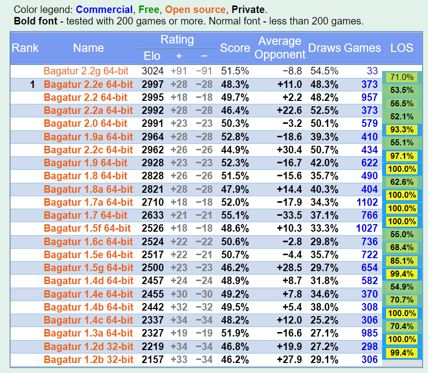

# Overview

Bagatur chess engine is one of the strongest Java chess engines in the world.

It runs on Android as well as on "desktop" Computers (or even on virtual machine with many CPU cores into the Cloud):
 - For desktop computers, it runs as a program whith a console and supports commands of the <a href="http://wbec-ridderkerk.nl/html/UCIProtocol.html">UCI protocol</a>. It could be easily imported in Chess programs with user interfaces, like <a href="http://www.playwitharena.de/">Arena Chess GUI</a>.
 - For Android, the app is available on different app stores <a href="https://metatransapps.com/bagatur-chess-engine-with-gui-chess-ai/">Bagatur Chess Engine with GUI</a>. It has its own user interface. The source code of the Android version is also open source and could be found here: https://github.com/MetatransApps/Android_APK_ChessEngineBagatur

If you like the project, please give it a star! :-)

# Downloads for desktop computer

- The new versions of Bagatur are released as standard github releases <a href="https://github.com/bagaturchess/Bagatur/releases">here</a>.
- The old versions of Bagatur are available on github under this <a href="https://github.com/bagaturchess/Bagatur/archive/refs/tags/ALL-OLD-VERSIONS-DOWNLOADS-BEFORE-BAGATUR-2.2E.zip">zip archive download</a>, which contains all old versions under the path "/Downloads/Engine/" inside the archive file.

# Running it

The program runs under all Operating Systems, which support Java platform:
* **Android**, <a href="https://metatransapps.com/bagatur-chess-engine-with-gui-chess-ai/">Bagatur Chess Engine with GUI</a>.
* **Windows**, there are *.exe files for direct run. Here are the steps necessary to run the engine:
  * Download an arbitrary UCI user interface. For example the most popular one is <a href="http://www.playwitharena.com/">Arena Chess GUI</a>.
  * Install the UCI user interface on your computer.
  * Ensure that the Java Runtime Environment (JRE) 1.8 or later is installed on your computer (it should be the case nowadays but if not, have in mind that JRE is required, only JDK doesn't work). It could be downloaded from <a href="https://java.com/">java.com</a>
  * Unpack this distribution somewhere (Arena has a sub-folder called 'engines', you can extract it there).
  * Open the UCI user interface and register the engine inside (You should become familiar with the installed UCI user interface anyway). You may use win32 or win64 version depending on your choice.
  * E2-E4 and enjoy :-)
* **Linux**, in the bin directory there are *.sh files for running

# UCI Options

Option available only for the <a href="https://www.chessprogramming.org/SMP">SMP version</a> of Bagatur. The SMP (multicore) version can be started by Bagatur_64_2+_cores.exe and Bagatur_mcore.bat for Windows and with Bagatur_mcore.sh under Linux. It is tested with up to 64 CPU cores and threads. There is known sclaing issues, caused by Java (more info here: https://github.com/bagaturchess/Bagatur/blob/master/Search/SMP.scaling.issue.txt).
 - SMP Threads (type spin default [logical_processors/2] min 1 max [logical_processors/2]):
 - CountTranspositionTables type spin default 1 min 1 max [SQRT(logical_processors/2)] - Defines the count of Transposition Tables, which the SMP version will use. In most cases, it should be best to be set to 1 and could be changed only for experiments. See also https://github.com/bagaturchess/Bagatur/blob/master/Search/SMP.scaling.issue.txt

All other options are available for both versions: single core and SMP.
 - Logging Policy (type combo default single file var single file var multiple files var none): whether Bagatur will create log files on the file system with details of its actions.
 - OwnBook (type check default true): whether to use the own book included into the download, which is packed under ./data/w.ob and ./data/b.ob. These are games extracted from a few milions of PGN games played last 20 years by grandmasters and computer programs. They are filtered and the files contain a subset of most often played games. Unfortunatelly the name of the used opening is not supported at the moment but this features is defenitelly in our backlog and will be included in the Android version.
 - Ponder (type check default true): whether to also think when the opponent thinks.
 - MultiPV (type spin default 1 min 1 max 100): whether to show only the best line or to show the best 2-3-N lines.
 - SyzygyPath (type string default ./data/egtb): path to the syzygy tables. If you send 'uci' command to the engine, it will show the full path to the syzygy directory.
 - SyzygyOnline: if true and TB probing with local files is unsuccessful with up to 7 pieces, than it will request lichess server on this url http://tablebase.lichess.ovh/standard?fen=...
 - Openning Mode (type combo default most played first var most played first var random intermediate var random full): Valid only when OwnBook is set to true. The 'most played first' option playes the most often played move (statistically) for given position. 'random full' option playes random move from all available opening moves for this postion. And the 'random intermediate' option is something in the middle and plays random move selected only from the top 3 available moves for this position.
 - UCI_Chess960 (type check default false): false = classic chess, true = Fischer Random Chess (both FRC and DFRC modes are supported). 
 - MemoryUsagePercent (type spin default 73 min 50 max 90): This is option for fine tunning and should not be changeed in general. It is Java specific and prevents the JVM to overdo the Garbage Collection.
 - TranspositionTable (type check default true): whether to use Transposition Table.
 - EvalCache (type check default true): whether to use cache for the evaluation function. (This cache is per thread for the SMP version)
 - SyzygyDTZCache (type check default true): whether to use cache for used syzygy scores. (This cache is per thread for the SMP version)

# Syzygy Endgame Tablebases

The download of Bagatur contains subset of syzygy tablebases placed under ./data/egtb/ directory. It contaiuns 22 of the most common endgames with up to 5 pieces. By default the option 'SyzygyPath' is set to this directory. You could change this UCI option if you have complete or bigger set of syzygy tablebases donwloaded on your computer.
 
# Elo Rating

Chess strength and rating of a chess engine is measured in Elo.
According to CCRL 40/15, the latest offical Elo ratings of all well tested version (with more than 300 games and time control 40/15), are available on this page: http://www.computerchess.org.uk/ccrl/4040/cgi/compare_engines.cgi?family=Bagatur

Special Thanks to <a href="https://www.chessprogramming.org/Graham_Banks">Graham Banks</a>, who put a huge efforts in testing Bagatur versions through the years!

Latest official Elo rating of Bagatur 2.2e is ~3000 Elo. To make it easy to check, here is a probably outdated screenshot of the computerchess.org web page above:

# Machine Learning

There are some code examples of Artificial Intelligence / Machine Learning experiments with the <a href="http://neuroph.sourceforge.net/">Neuroph</a> 2.94 Java framework.
The starting point into the source code is located <a href="https://github.com/bagaturchess/Bagatur/tree/master/LearningImpl/src/bagaturchess/deeplearning/run">here</a> and the documentation is <a href="https://github.com/bagaturchess/Bagatur/tree/master/LearningImpl">here</a>.
Although the Elo strength of the experimential version is with 50 Elo less than the version with the manually tuned evaluation function's parameters, the results are successful meaning that the neural network's <a href="https://en.wikipedia.org/wiki/Backpropagation">backpropagation</a> algorithm works as expected for <a href="https://en.wikipedia.org/wiki/Multilayer_perceptron">multi layer perceptron</a> neural network. This makes the experiments a good showcase of <a href="http://neuroph.sourceforge.net/">Neuroph</a> Java framework.

Additional resources:
- <a href="https://github.com/bagaturchess/Bagatur/tree/master/LearningImpl/">Machine Learning / LearningImpl</a>
- <a href="https://github.com/bagaturchess/Bagatur/tree/master/UCITracker/">Machine Learning / UCITracker</a>

# More readings with technical details and explanations for each sub-component of Bagatur
- <a href=https://github.com/bagaturchess/Bagatur/blob/master/Bitboard/readme.txt>Bitboard</a>
- <a href=https://github.com/bagaturchess/Bagatur/blob/master/EGTB/readme.txt>Endgame Tablebases</a>
- <a href=https://github.com/bagaturchess/Bagatur/tree/master/LearningImpl>Machine Learning</a>
- <a href=https://github.com/bagaturchess/Bagatur/edit/master/Opening/readme.txt>Opening API</a>
- <a href=https://github.com/bagaturchess/Bagatur/edit/master/OpeningGenerator/readme.txt>Opening Generator</a>
- <a href=https://github.com/bagaturchess/Bagatur/blob/master/PGNProcessor/readme.txt>PGNProcessor</a>
- <a href=https://github.com/bagaturchess/Bagatur/blob/master/Search/readme.txt>Search Algorithm</a>
- <a href=https://github.com/bagaturchess/Bagatur/tree/master/UCITracker>UCITracker</a>

# Bagatur is powered by <a href="https://www.yourkit.com/java/profiler/">YourKit Java Profiler</a>

This nice tool is used to find out and fix performance, scalability and memory allocation isses.
In general YourKit supports open source projects with innovative and intelligent tools for monitoring and profiling.

# When and how Bagatur Chess Engine project has started
The project has started as a bet between myself and one of my friends from my first 2 years in the University, who like to play chess.
I was unable to win a single chess game against him! This made me nervous over the time and at the end I have promised him (we bet) that I will create a chess program, which will win a game against him!
Fortunately the time frame was not mentioned during the bet and ... years later I win it! :-)
The whole story is captured in this youtube video "How was the idea of Bagatur Chess Engine application born?": https://www.youtube.com/watch?v=_rNBxbUAbS0

The first public, open source version of Bagatur was available since 2011-02-27 here: https://sourceforge.net/projects/bagaturchess/files/BagaturEngine/older/
The project actually started ~10 years before this date. The actual start date was between 1999 and 2000.
It had many proprietary non-public versions until 2011. I even don't have history of them but they were quite weak in playing chess. First versions just succeeded to play 2-3 moves and then crashes. I have spend hours and days trying to fix the bugs and find out why it doesn't work correctly.
At this point in time, the internet was almost an empty space and I was not aware of softwares running chess engines like now CuteChess and Arena and I was not aware of the existence of the UCI protocol, so I also have created an own Graphical User Interface (GUI) based on Java AWT and Swing.
Chess porgramming gives you diverse programming experiences ...
I have selected Java as a programming language, mainly because of my little (but existing) experience with it.
I have to also admit that Java was quite modern and polular at this point in time. This was the time a few years after the first releases of the Java itself. The early ages of the Java language and Java technologies.

So, if you plan to work on a chess engine, better start earlier, you need time to achieve stable version which beats you! :-)

# Contact the Author

In order to contact me, you could use LinkedIn <a href="https://www.linkedin.com/in/topchiyski/">Krasimir Topchiyski</a> or email me at k_topchiyski@yahoo.com

Some personal toughts ...

According to CCRL, there are below 500 chess engines in the world.
This means that not many people are really interested in programming chess engines.
Most probably the author of a chess engine is interested not only in programming but also in chess game. He/she must have enough willingness to invest spare time in chess programing, without any incentives, just for fun and driven by curiosity.

Because of this fact, I am always happy to see new engines and new authors!

I don't know for the other chess engine authors, but I would add small and well balanced portion of craziness ... it helps in chess programming, while you release version after version, targeting better Elo stregnth of each new release, which actually happens in very rear cases and you cannot release a version long time.
If this continues months, normally I feel it like "to bang your head against the wall". When I reach this state, I exit Bagatur project for a while, awaiting for new inspiration and the muse. Always remember, it should be for fun! :-)

# Old Revision History before version 2.2e
Version 2.2e (16 August 2021), 2997 Elo
  * Enable ContinuationHistory as it is obviously the best option for move ordering. Without it, the engine performs with 50 Elo less.
  * The SMP version still scales well on many CPUs after splitting the evaluation cache per each thread.

Version 2.2d (20 May 2021)
  * SMP version: split evaluation cache per thread for better scalability on many CPUs
  * Fix memory allocation problem in the data structure, which collects the best line

Version 2.2c (2 May 2021), 2962 Elo
  * SMP version: Disable ContinuationHistory as it consumes too much memory per each search thread. When the memory is close to the upper limit, the performance of the Java program is slow.

Version 2.2b (30 April 2021)
  * No changes in the single core version
  * Fixes in nodes counting (NPS) in SMP version (reported by TCEC, Aloril)
  * Optimizations in SMP version (reported by TCEC, Aloril)

Version 2.2a (21 February 2021), 2992 Elo
  * Optimizations of search and qsearch with small Elo increase (~15)
  * Bugfixing

Version 2.2 (29 May 2020), 2995 Elo
  * Reduced LMR and LMP for moves with high history scores
  * SMP based on threads (not processes), it is now with 65+ Elo stronger than the single core version
  * Injected icon in the executable files and update of WinRun4J to version 0.4.5

Version 2.1a (21 May 2020)
  * Improvements in single core version with small Elo increase
  * Evaluation cache increased to 256M for better performance
  * Additional fixes in SMP version: parallel start and stop of the slave threads

Version 2.1 (1 May 2020)
  * No changes in the single core version
  * Fixed SMP version, which now works better than the single core version :-)
  * In SMP version: increased max threads count from 64 to 256

Version 2.0 (13 March 2019), 2991 Elo
  * New evaluation function, based on Chess22k
  
Version 1.9b (7 March 2020)
  * Bugfix: parallel search now works on Linux, just use ./bin/Bagatur_mcore.sh
  
Version 1.9a (14 January 2020), 2964 Elo
  * Optimization: don't perform NonPv search in the root position
  * Improvement: add piece-to history supplementary to from-to history heuristic

Version 1.9 (19 December 2019), 2928 Elo
  * New search algorithm, based on the Chess22k
  * Search improvements: Use transposition table in quiescence search
  * Search improvements: Disable futility pruning in quiescence search (for positions in check)
  * Search improvements: New beta window generation in MTD(f) implementation 
  
Version 1.8a (20 September 2019), 2821 Elo
  * Enable Syzygy tablebases for SMP version
  * Corrections in PV search and collection of the best line
  * Now LMR has new formula

Version 1.8 (30 July 2019), 2828 Elo
  * New evaluation function, based on the Stockfish
  * Time control optimization for SMP version - don't use too much time if evaluation changes 

Version 1.7b (2 July 2019)
  * Bugfix: into the time control found during TCEC Season 16 testing by Aloril

Version 1.7a (18 April 2019), 2710 Elo
  * Optimizations of move ordering: bad captures are ordered with higher value
  * Optimizations of move ordering: piece-square tables are not used in ordering

Version 1.7 (29 March 2019), 2633 Elo
  * Support for Syzygy tablebases, based on the java porting done by ljgw https://github.com/ljgw/syzygy-bridge
  * New evaluation function

Version 1.6c (15 March 2019), 2524 Elo
  * Parallel search: now improved with several bug fixes
  * Parallel search: UCI option implemented for Thread Memory (MB)
  * Late move reduction is now more aggressive for all nodes

Version 1.6b (21 February 2019)
  * Late move reduction is now decreased for PV nodes (+30 Elo)

Version 1.6a (11 February 2019)
  * Revert memory management experiments introduced with versions 1.5g and 1.6
  * More deeper internal iterative deepening search
  * Late move reduction is now adjusted with move's history scores
  
Version 1.6 (17 January 2019)
  * Separate transposition tables for search and qsearch for better memory management
  * Use both transposition tables when probing position
  * If presented use transposition table scores before qsearch
  
Version 1.5g (14 January 2019), 2500 Elo
  * Memory management improvements - more memory for the transposition table
  * Use Late move reduction for remaining depth > 3

Version 1.5f (31 October 2018), 2526 Elo
  * 15 Elo stronger (measured versus 1.5e)
  * Time management improvements
  * Singular move extension implemented
  * Optimizations of quiescence search - it search all capture moves
  
Version 1.5e (20 July 2017), 2517 Elo
  * Endgame Tablebases support - switched OFF, because of engine crash errors (JNI and java OutOfMemory related)
  
Version 1.5d (15 July 2017)
  * Search optimizations: added move history pruning and move count pruning
  * Search optimizations: tuning of late move reduction
  * Search optimizations: tuning of null move
  * Search optimizations: switch OFF check extension
  
Version 1.5c (29 May 2017)
  * Search optimizations: improved moves history table (PieceTo implementation)
  
Version 1.5b (25 May 2017)
  * Search optimizations: less aggressive late move reduction
  * Search optimizations: switch ON check extension
  
Version 1.5a (11 May 2017)
  * Endgames without pawns - adding material imbalance to mock-up evaluation
  * Evaluation function - tuning of all features
  
Version 1.5 (3 May 2017)
  * 35+ Elo stronger (measured versus 1.4e)
  * Search optimizations: adjusted best move window
  * More tuning of Endgame's mate search - use endgame table bases after depth 13
  
Version 1.4e (15 April 2017), 2455 Elo
  * Evaluation function tunning (versus Stockfish7)
  * Endgame improvements for mate search - use endgame table bases after depth 15

Version 1.4d (31 August 2016), 2457 Elo
  * Memory optimizations: increased memory usage percent, hence more entries into the transposition table (now on 40/40 time controls search goes deeper)
  * Fix for endgames without pawns
  * Fix for mate distance prunning
  * Updated readme files
  
Version 1.4c (15 June 2016), 2337 Elo
  * 25+ Elo stronger (measured versus 1.4b with 150+ games - 1m+1s and 5m+5s time controls)
  * Memory optimizations: no java objects creation during search, hence less java garbage collection and more engine performance
  * Renamed *.exe files
  
Version 1.4b (31 May 2016), 2442 Elo
  * 28+ Elo stronger (measured versus 1.4a)
  * Search optimizations: adjustments of the depth reduction amount used in late move reduction and null move reduction
  * Default memory increased from 256MB to 1024MB. Could be set in the corresponding *.ini files to *exe files (or bat files if you don't use *.exe starters)
  * Fixes in UCI communication with Arena UI (e.g. start-stop issues, MultiPV under Pondering issues)
  
Version 1.4a (24 May 2016)
  * Bugfix: removed bug when in some endgames engine just stop thinking
  * New UCI option Openning Mode - 'random' and 'most played first'
  * Changed logo
  * Simplified distribution structure
  
Version 1.4 (11 May 2016)
  * 35+ Elo stronger!
  * Added Windows 64 support for Gaviota Endgame Tablebases
  * Search optimizations: New depth reduction function used in late move reduction, extensions adjustments, more reliable static pruning, separate transposition table per CPU (preparation for the new parallel search)
  * Evaluation function: support for double bishops, good and bad bishops
  * Draw probability adjustment for endgames with different colored bishops
  * Updated *.exe files to support Java 7 and Java 8
  * Default memory increased from 128MB to 256MB. Could be set in the corresponding *.ini files to *exe files (or bat files if you don't use *.exe starters)
  * Improved memory management
  * Fixed Pondering
  
Version 1.3a (07 December 2012), 2327 Elo
  * Endgame Tablebases support - Gaviota EGTB (currently, for win 32 only). Find more details in readme.txt.
  * New UCI option 'Logging Policy' is introduced - 'single file', 'multiple files' and 'none'
  * SMP version: fixed Operation System dependent issue, which causes the engine to use only one thread in some conditions
  
Version 1.3 (05 July 2012)
  * SMP version is finally enabled and now works as expected. Your feedback is welcome, especially if you run it on more than 2 physical CPUs.
  * Fixed new bug which appears in rare cases and cause the engine to exit with error
  
Version 1.2g (5 June 2012)
  * 50 Elo stronger! Improved search algorithm (e.g. better tuned null move pruning)
  * Improved SMP version although there is still room for improvement
  
Version 1.2f (26 May 2012)
  * SMP version is now stronger. It is working with the latest 'single core' searcher algorithm as a basis
  * Fixed bug which appears in rare cases and cause the engine to stop working
  
Version 1.2e (12 May 2012)
  * 40 Elo stronger: optimized search - improved move ordering and search parameters
  
Version 1.2d (9 December 2011), 2219 Elo
  * 30 Elo stronger: optimized search - use the data from unsuccessful null move search in order not to reduce the strongest move of opponent
  * bugfix: "loss on time" introduced by version 1.2c
  
Version 1.2c (4 December 2011)
  * 30 Elo stronger: optimized search by making null move heuristic a bit more aggressive
  
Version 1.2b (3 November 2011), 2157 Elo
  * bugfix: read and use the option set for threads count of SMP version
  
Version 1.2a (30 October 2011)
  * 50 Elo stronger than version 1.2. Achieved by tuning of search algorithm.
  * Min threads count of SMP version are set to 2. Reported by Olivier Deville during OpenWar 9th Edition test games
  * Default process priority is set to 'normal'
  * Technical: Refactoring of configuration API & Impl code
  
Version 1.2 (10 September 2011)
  * MultiPV search mode implemented! (a.k.a K-Best Moves search)
  * Improved time-control of 'sudden death' playing mode (reported by Lars Hallerstrom during ChessWar XVII)
  * Reduced adaptive extensions in non-pv nodes for better and faster search. Now in most cases the engine succeed to make one additional iteration for the same time.
  * Evaluation: Increased King Safety weight with 10%
  
Version 1.1.3 (27 August 2011)
  * Fixed "loss on time" issue during time-per-move mode. Reported by Olivier Deville during ChessWar XVII test games
  * Fixed "loss on time" issue in 40th move with tournament time controls like 40/X. Again catched and reported by Olivier Deville
  * Fixed issue in 64 bits EXE - again memory issue which appears in some rare cases 
  * Updated readme files (e.g. credits section)
  * UCI: Usage of Transposition table entries' scores in PV nodes is implemented as UCI option (default value is false)
  * Technical: Trust window of MTD search is now adaptive and vary between 0 and 32 centipawn depending on the stability of the best move (bigger stability when one and the same best move appears in more search iterations)
  * Technical: Transposition table's entries (their scores) in PV nodes are used only if the length of the best line is enough (with the expected depth)
  * Technical: Big source code refactoring in regards to the changes of the configuration concept
  
Version 1.1.2 (23 August 2011)
  * Hot-fix of memory issue. Engine hangs and throws OutOfMemory error after last memory tunings in version 1.1.1. Now it should work fine.
  * Decreased trust window of MTD Search from 8 to 0. Now each iteration needs a bit more researches but on the other hand more transposition table's entries has 'exact' type. 
  * Enable the usage of transposition table's entries (their scores) also in PV nodes
  * UCI: Fixed issue in 'setoption' UCI command. Sometimes Arena sends not only name-value pair but also additional information.
  * Changed own opening book. The new one is based on Hitman 5.2.
  
Version 1.1.1 (17 August 2011)
  * Added EXE files for 32 and 64 bits Windows platforms. Now the usage is easy and the engine could be used in different UIs (then Arena) like Fritz and Polyglot.
  * Default memory decreased from 256MB to 128MB. Could be set in the corresponding *.ini files to *exe files (or bat files if you don't use *.exe starters)
  * More efficient cache usage - Transposition Table 40% of the free memory, Eval Cache - 40% of the free memory, Pawns Eval Cache - 20 % of the free memory.
  * Directory structure of the distribution (zip file) is changed again.
  * Fixed 'slow search' problem. It appears sometimes with given combination of hardware/windows/java and is related with the limited speed of I/O operations with the file system and process streams.
  * UCI: uci options for evaluation function are implemented. Now the weights could be set from GUI. The following evaluation's components are included: King Safety, Mobility, Safe Mobility, Cental Space, Piece-Square, Pawns Structure, Passed Pawns.
  * UCI: Send search information more often to UCI GUI (not only with the best line / principal variation)
  * UCI: Go search with count of 'nodes' implemented
  * UCI: Move immediately if mate is found in 3 sequential search depths
  
Version 1.1.0 (2 August 2011)
  * Pondering mode implemented! Mate distance pruning disabled during Pondering.
  * Added to-do list in the distribution. Feel free to contribute. :-)
  * Bagatur's LOGO changed. Many thanks to Dusan Stamenkovic, http://www.chessmosaic.com/
  * Improved time management: work well in tournament mode (with given moves to the next control a.k.a. 'movestogo' property of 'go' UCI command)
  * Fixed bug reported during ChessWar XVII: Use 'long algebraic notation' instead of SAN in order to be UCI compatible
  * Fixed bug reported during ChessWar XVII: Parallel search is now optional. Two separate *.bat files are created for running Bagatur on either signle-core or multi-core.
  * Disable usage of opening book and single reply optimization during analyze mode
  * Improved read-me file: Fixed typos. Added 'Clarifications' section. Added 'Credits' section. 
  * Changed directory structure of the distribution. Added 'bin' and 'dat' folders.
  
Version 1.0.1 (22 July 2011)
  * Fixed bug reported during ChessWar XVII: "Loss on time" in games with fixed time (without time's increment per move)
  * Reduced debug information in the engine's log file
  
Version 1.0.0 (27 Feb 2011)
  * Initial code base
  
